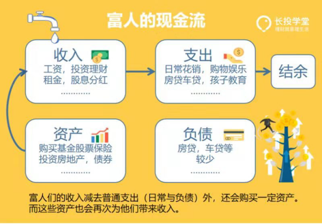
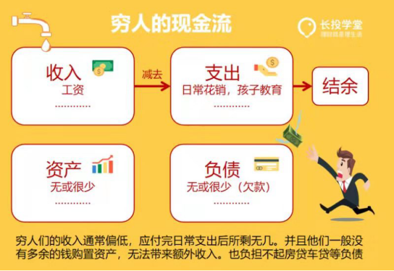

> 资产 = 负债 + 所有者权益

> 对于没有财富承接能力的人，暴富是一场灾难。

> 资产：给自己带来收益或者说把钱放进你口袋里的东西。负债：金钱会流出或者说把钱从你的口袋里取走的东西。

**成为富人的第一个秘密是：在一生中不断地买入资产！**

> 穷人为什么穷？因为他们不断地买入负债或没有可持续利用价值的东西。

富人的现金流表

> 富人的秘密：资产品种丰富，给自己带来更多收入，不只靠工资！如果你的收入只有工资，那你真的要好好反省了。

> 当我们的被动收入能够覆盖掉支出的时候，我们就实现了我们所理想的“财务自由”。

穷人的现金流表

> 穷人要不时的分析一下，自己的花费，哪些是资产，哪些是负债，争取以后更多的买入资产！

**富人的第二个秘密：对待新鲜事物的态度。**

世界上没有只赚不亏的投资，如果有的话，那一定是投资自己！

> “富人”乐意接受新鲜的事物，并在不断增长见识的过程中，提升自己辨别事物的能力，同时结交更多的朋友，拓展自己的圈子，遇到更多的贵人，进而良性循环！

> 而穷人对于任何新鲜的事物，第一反应就是屏蔽，或者说是封闭自我。因此穷人的眼界 会越来越窄，见识越来越短，赚钱的道路也会越来越单一，工作越来越勤奋，但是人生越来越穷……

**穷人的两个问题**

- 收入偏低
- 穷人能不能拥有资产？

> 1、收入偏低的话。第一学会省钱，第二学会花钱！学会省钱的意思就是要学会分清**必须**、**需要**和**想要**的花费。合理分配欲望，控制在“必要”和“想要”之间，更好地分配自己的资金，并且坚持理财投资！

房租吃饭属于**必须**，吃水果喝牛奶补充维生素属于**需要**，奢侈品属于**想要**。

> 2、穷人能不能拥有资产。理解复利增长的概念。
>
> 定投计算器：http://www.cebbank.com/site/gryw/jsq/jjsyljsq/jjdtsyljsq/index.html。
>
> 穷人需要做两件事：
>
> - 学会理财技能，为自己不断积累资产！
> - 多学理财知识，并尝试各种理财产品，找到适合自己的理财品种。
>   - 先储蓄，再消费，先从储蓄10%的月收入开始，生活质量不会下降很明显，同时比较容易坚持；
>   - 投资自己，提升个人技能，自我增值才是最好的投资；

